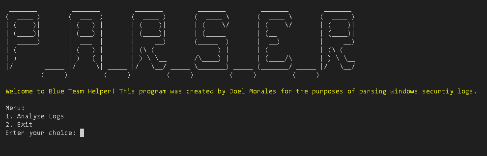

# Blue Team Helper 🚀

**Blue Team Helper** is a Python project created by Joel Morales for generating and analyzing Windows security logs. Perfect for blue teams, SOC analysts, and cybersecurity enthusiasts to practice log analysis and improve threat detection skills in a simulated training enviroment. 

---

## Features 🌟
- **Log Generation**: Create realistic logs with:
  - Successful logins.
  - Failed logins.
  - Suspicious activities.
- **Log Parsing**: Analyze logs for:
  - Failed login attempts.
  - Connections from flagged IPs (with geolocation).
  - Events during unusual hours (e.g., midnight–6 AM).
- **User-Friendly UI**: Menu-driven design with ASCII art.
- **CSV Export**: Save analysis results to CSV files for easy review.

---

## Screenshots 📸

### Log Generator


### Log Parser


---

## Getting Started 🚀
### Clone the Repository
```bash
git clone https://github.com/Himmyneutron/BlueTeamHelper.git
cd BlueTeamHelper

##Install the required Python libraries 
pip install pandas faker colorama art

##Run the log generator to create realistic logs
python generate_logs.py
